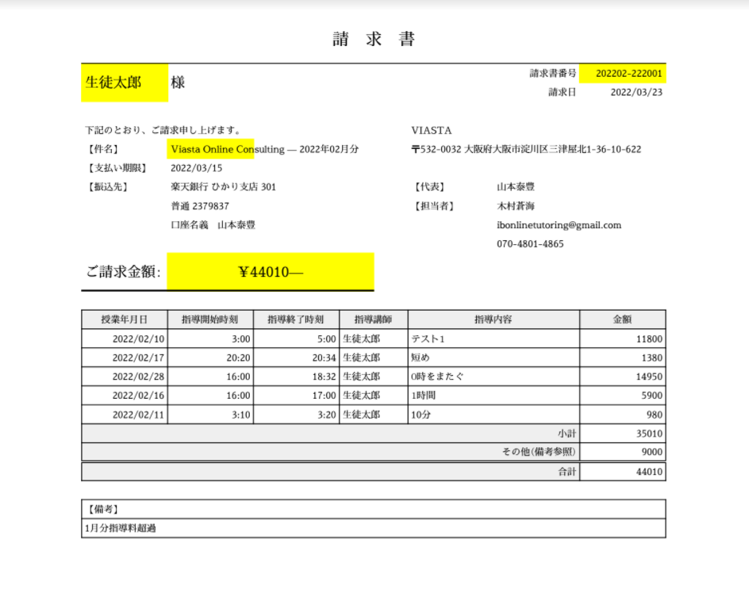

# 変更履歴

## 3/20

<https://github.com/ShutaShibue/viasta/tree/0d1cf7988b5f4269e788f5dd2e8b647ddfa88295>

やはり全てが1ファイルにまとまっていると保守性が悪いので、とりあえずDictionary作成関数は各ファイルに分割し、クラス化しました。
それに伴って、クラス名を変更しました。

- PersonalData.gs　旧constructStudentDict、constructtutorDict
- ShidouData.gs  旧constructShidouDict
- ShidouPerson.gs  旧constructShidouStudentDict、constructShidouTutorDict (機能がほぼ一緒なので統一)

残りは当初のファイルに据え置き(今後分離します)
これで読みやすくなったので、明日必要な機能を追加していきます。

## 3/21

<https://github.com/ShutaShibue/viasta/tree/653d395268538102a417d4e993e3e71050ea4ce0>

- 正しい情報が記載されるようにSetPdfData.gsを作成、更新
  
## 3/23

  <https://github.com/ShutaShibue/viasta/tree/92ed0c6ba4de066401816ad401e7694fbe19fce1>

- 調整管理データ、仕事データを保持するクラスを追加
- 調整管理データを各人のデータに追加するメソッドをShidouPersonクラスに追加
- 次回のタスク：調整管理データをSetPdfDataで記載する
  
## 3/24

<https://github.com/ShutaShibue/viasta/tree/88db19a19c2f4bb1ca1802b272d33ee9ed755053>

- 明細に調整管理データを反映

## 3/25

- 指導データのみ、調整管理データのみでも動くように修正
- 備考欄が伸びない問題は未修正　→解決
