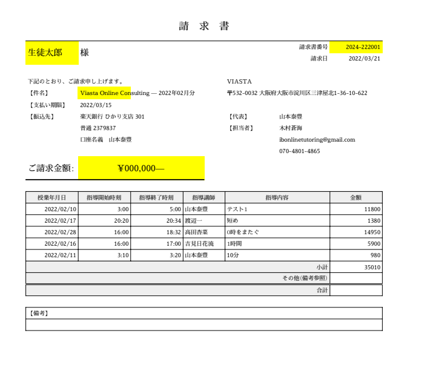

# 変更履歴

## 3/20

<https://github.com/ShutaShibue/viasta/tree/0d1cf7988b5f4269e788f5dd2e8b647ddfa88295>

やはり全てが1ファイルにまとまっていると保守性が悪いので、とりあえずDictionary作成関数は各ファイルに分割し、クラス化しました。
それに伴って、クラス名を変更しました。

- PersonalData.gs　旧constructStudentDict、constructtutorDict
- ShidouData.gs  旧constructShidouDict
- ShidouPerson.gs  旧constructShidouStudentDict、constructShidouTutorDict (機能がほぼ一緒なので統一)

残りは当初のファイルに据え置き(今後分離します)
これで読みやすくなったので、明日必要な機能を追加していきます。

## 3/21

- 正しい情報が記載されるようにSetPdfData.gsを作成、更新
  